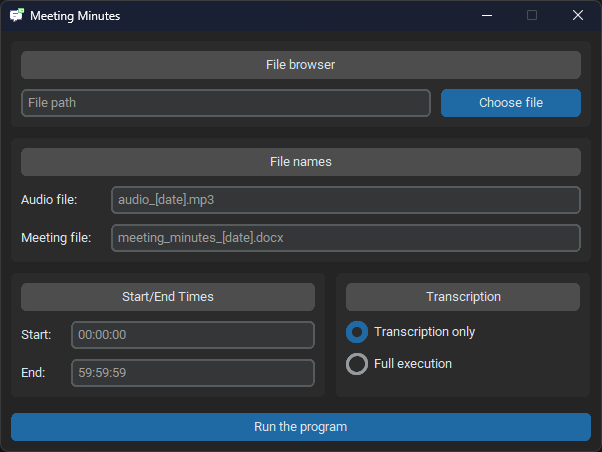

# User Manual

Team : Théo Pirouelle

<a href="https://www.python.org/">
  
</a>

---

## Preamble

To use the script, you'll need an [OpenAI API key](https://platform.openai.com/account/api-keys) for Whisper and GPT-4.
You'll need to create a `.env` file with the `API_KEY` variable with your API key for the script to work properly.

The script on the repository is configured in French; it's easy to modify the script to adapt it to another language (just translate the few instructions given to GPT).

> [!IMPORTANT]
> To use the application, you need to be connected to the Internet so that it can call the OpenAI API.

## Installation

> [!IMPORTANT]
> For the application to work properly, the `.env` file must be in the same place as the executable.

> [!NOTE]
> For information, the code has been developed and works with the following library versions:
> | Library | Version |
> | --- | --- |
> | openai | 0.28.0 |
> | python-docx | 1.1.0 |
> | pydub | 0.25.1 |
> | ffmpeg-python | 0.2.0 |
> | customtkinter | 4.0.2 |

### Linux

You will also need to install the necessary :
```bash
sudo apt-get update && sudo apt-get upgrade -y

sudo apt install ffmpeg
sudo apt install python3
sudo apt install python3-pip

pip3 install customtkinter
pip3 install python-dotenv
pip3 install openai==0.28
pip3 install pydub
pip3 install python-docx
pip3 install ffmpeg-python
```

### Windows

1. Download and install [Python](https://www.python.org/)
2. Check that Python is installed using the following command: `python --version` or `python3 --version`.
3. Download and install [FFmpeg](https://ffmpeg.org/)
   - Extract the downloaded file to a location of your choice on your computer (somewhere easy to access).
4. To add FFmpeg to the Windows PATH, follow these steps: 
   - Open System Properties: Right-click on the Start button and choose "*System*". Then click on "*Advanced system settings*" on the left-hand side of the window (on Windows 10) or below the "*Device specifications*" section (on Windows 11).
   - Environment variables: In the "*Advanced*" tab, click the "*Environment Variables...*" button at the bottom.
   - Edit PATH: Under "*System variables*", find the `Path` variable and click on it, then click on "*Edit...*". If you are running Windows 10 or Windows 11, this will open a window with a list of paths.
   - Add the FFmpeg path: Click "*New*" and type the path to the bin folder of your FFmpeg installation. If you extracted FFmpeg to `C:\FFmpeg`, the path to add will probably be `C:\FFmpeg\bin`.
   - Save and close: Click "*OK*" to close the `Path` editing window, then "*OK*" again to close the "*Environment Variables*" window and "*OK*" once more to close the "*System Properties*".
5. Check that FFmpeg is installed using the following command: `ffmpeg -version`.
   - This command should display the version of FFmpeg installed and the configuration. If you get an error message saying that FFmpeg is not recognised as an internal or external command, this means that FFmpeg has not been correctly added to the PATH or that the terminal needs to be restarted.

You will also need to install the necessary :
```shell
pip install customtkinter
pip install python-dotenv
pip install openai==0.28
pip install pydub
pip install python-docx
pip install ffmpeg-python
```

## Build

You can build the application using `PyInstaller`.

```bash
pip install pyinstaller

pyinstaller --onefile --noconsole src/application.py
```

## Usage

Double-click on the executable or use `./application[.exe]` from the command line.



The only mandatory cells are "*File browser*" and "*Transcription*", the others such as "*File names*" and "*Start/End Times*" are optional and will have a default value.

The "*File browser*" section is mandatory and takes as input the file to which the application will be applied.
> [!WARNING]
> The file must be a `.mp3` or `.mkv`.

The "*File names*" section is optional and can take as input the name of the output audio and text files. The default values are "*audio_[date]*" and "*meeting_minutes_[date]*".

The "*Start/End Times*" section is optional and can take as input the start and end times of the output audio file. By default, their respective values are "*00:00:00*" and "*[file_end_value]*". The input must be in the format `[00-59]:[00-59]:[00-59]`.

The "*Transcription*" section is mandatory and offers a choice between "*Transcription only*", which will output a text file with only the transcription of the input audio file, or "*Full execution*", which will output a text file with the transcription of the input audio file as well as a summary, a list of key points and a list of action items.

## Performance

Here are the performances I've seen in use:

| Model | Recording time | Treatment duration | Cost |
| --- | --- | --- | --- |
| gpt-4 | 1min | 40sec |  |
| gpt-4 | 3min | 2min | 0.07$ |
| gpt-4 | 10min | 3min30 | 0.11$ |
| gpt-4-1106-preview | 10min | 1min20 | 0.17$ |
| gpt-4 | 15min |  | 0.49$ |
| gpt-4-1106-preview | 16min37 | 3min20 | 0.27$ |
| gpt-4-1106-preview | 17min32 | 2min13 | 0.26$ |
| gpt-4-1106-preview | 18min35 | 3min28 | 0.22$ |
| gpt-4 | 27min17 | 4min15 | 0.79$ |

You can change the model used in the code by modifying the `model_gpt` variable. You can find a list of the different GPT models supported on the [OpenAI website](https://platform.openai.com/docs/guides/function-calling), along with the methods of use for API calls.

You can find costs for the various models (including Whisper and GPT-4) on the [OpenAI website](https://openai.com/pricing).

You can also find all your consumption for the current month, as well as your payment history, on the [Usage page](https://platform.openai.com/usage).
